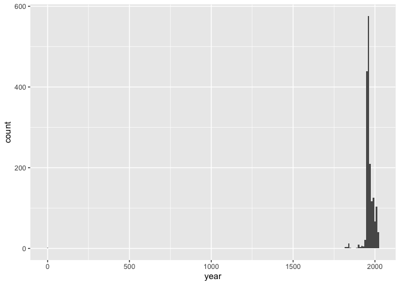
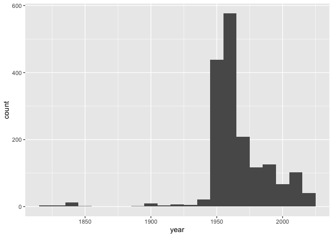

Lab 08 - University of Edinburgh Art Collection
================
Anaelle Gackiere
03-06-2026

## Load Packages and Data

First, let’s load the necessary packages:

``` r
library(tidyverse) 
library(skimr)
```

Now, load the dataset. If your data isn’t ready yet, you can leave
`eval = FALSE` for now and update it when needed.

``` r
uoe_art <- read_csv("data/uoe-art.csv")
```

## Exercise 10

Let’s start working with the **title** column by separating the title
and the date:

``` r
uoe_art <- uoe_art %>%
  separate(title, into = c("title", "date"), sep = "\\(") %>%
  mutate(year = str_remove(date, "\\)") %>% as.numeric()) %>%
  select(title, artist, year, link)  
```

    ## Warning: Expected 2 pieces. Additional pieces discarded in 58 rows [26, 54, 104, 214,
    ## 277, 351, 363, 434, 562, 563, 726, 728, 731, 754, 762, 789, 810, 834, 936,
    ## 1072, ...].

    ## Warning: Expected 2 pieces. Missing pieces filled with `NA` in 599 rows [3, 14, 16, 28,
    ## 30, 51, 53, 55, 62, 77, 81, 84, 94, 97, 99, 105, 106, 109, 110, 111, ...].

    ## Warning: There was 1 warning in `mutate()`.
    ## ℹ In argument: `year = str_remove(date, "\\)") %>% as.numeric()`.
    ## Caused by warning in `str_remove(date, "\\)") %>% as.numeric()`:
    ## ! NAs introduced by coercion

## Exercise 11

*Write your answer here.*

``` r
skim(uoe_art)
```

|                                                  |         |
|:-------------------------------------------------|:--------|
| Name                                             | uoe_art |
| Number of rows                                   | 3321    |
| Number of columns                                | 4       |
| \_\_\_\_\_\_\_\_\_\_\_\_\_\_\_\_\_\_\_\_\_\_\_   |         |
| Column type frequency:                           |         |
| character                                        | 3       |
| numeric                                          | 1       |
| \_\_\_\_\_\_\_\_\_\_\_\_\_\_\_\_\_\_\_\_\_\_\_\_ |         |
| Group variables                                  | None    |

Data summary

**Variable type: character**

| skim_variable | n_missing | complete_rate | min | max | empty | n_unique | whitespace |
|:--------------|----------:|--------------:|----:|----:|------:|---------:|-----------:|
| title         |         0 |          1.00 |   0 | 282 |     1 |     1635 |          0 |
| artist        |       108 |          0.97 |   2 |  55 |     0 |     1202 |          0 |
| link          |         0 |          1.00 |  26 |  29 |     0 |     3321 |          0 |

**Variable type: numeric**

| skim_variable | n_missing | complete_rate |    mean |   sd |  p0 |  p25 |  p50 |  p75 | p100 | hist  |
|:--------------|----------:|--------------:|--------:|-----:|----:|-----:|-----:|-----:|-----:|:------|
| year          |      1575 |          0.53 | 1964.75 | 53.1 |   2 | 1953 | 1962 | 1978 | 2024 | ▁▁▁▁▇ |

## Exercise 12

*Continue with the same structure as above.*

``` r
ggplot(uoe_art, aes(x = year)) +
  geom_histogram(binwidth = 10)
```

    ## Warning: Removed 1575 rows containing non-finite outside the scale range
    ## (`stat_bin()`).

<!-- -->

``` r
uoe_art %>%
  filter(!is.na(year)) %>%
  arrange(year) %>%
  head(5)
```

    ## # A tibble: 5 × 4
    ##   title                    artist         year link                         
    ##   <chr>                    <chr>         <dbl> <chr>                        
    ## 1 "Death Mask "            H. Dempshall      2 ./record/21649?highlight=*:* 
    ## 2 "Mary Ann Park Sampler " Mary Ann Park  1819 ./record/102706?highlight=*:*
    ## 3 "Fine lawn collar "      Unknown        1820 ./record/102681?highlight=*:*
    ## 4 "Dying Gaul "            Unknown        1822 ./record/20597?highlight=*:* 
    ## 5 "The Dead Christ "       Unknown        1831 ./record/20573?highlight=*:*

# Exercise 13

``` r
uoe_art <- uoe_art %>%
  mutate(year = if_else(year == 2, 1964, year))
ggplot(uoe_art, aes(x = year)) +
  geom_histogram(binwidth = 10)
```

    ## Warning: Removed 1575 rows containing non-finite outside the scale range
    ## (`stat_bin()`).

<!-- -->

# Exercise 14

``` r
uoe_art %>%
  count(artist, sort = TRUE) %>%
  head()
```

    ## # A tibble: 6 × 2
    ##   artist               n
    ##   <chr>            <int>
    ## 1 Unknown            371
    ## 2 Emma Gillies       175
    ## 3 <NA>               108
    ## 4 Ann F Ward          23
    ## 5 John Bellany        22
    ## 6 Zygmunt Bukowski    21

The most commonly featured artist in the collection is **“Unknown”**.
The university likely has many pieces of unknown artists because they
might have been found or donated without any identifying information.

# Exercise 15

``` r
childc <- uoe_art %>%
  filter(str_detect(title, regex("child", ignore_case = TRUE))) 
```

It appears that `11` art pieces have the word “child” in their title.
